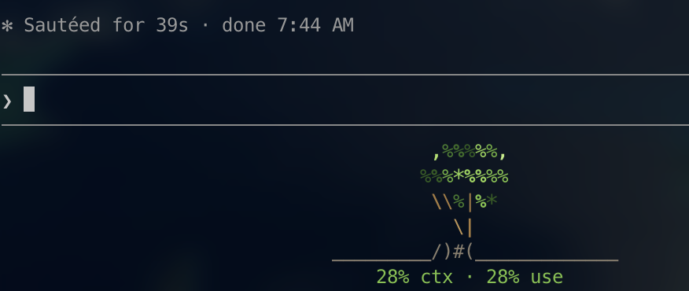

# claude-bonsai

A colorful ASCII tree for the Claude Code statusline. It starts as a sapling and
grows through five stages as your session fills up context and burns through
your usage window.



Full-grown, it looks like this:

```
       %%%,%%%%%%%
       ,'%% \\-*%%%%%%%
 ;%%%%%*%   _%%%%"
  ,%%%       \(_.*%%%%.
  % *%%, ,%%%%*(    '
%^     ,*%%% )\|,%%*%,_
     *%    \/ #).-"*%%*
         _.) ,/ *%,
 _________/)#(_____________
19% ctx · 61% use (resets in 3h 6m)
```

## Credit

The full-grown tree is ASCII art by **Joris Bellenger** (`b'ger`), from
[asciiart.website/art/3809](https://asciiart.website/art/3809). The four smaller
growth stages are drawn in the same style. The art is reproduced unmodified; this
plugin only colors it and picks a stage.

## Requirements

- `python3` (stdlib only — no packages to install)
- A truecolor terminal

## Install

```bash
claude plugin marketplace add k-blo/claude-bonsai
claude plugin install claude-bonsai@claude-bonsai
```

Then, inside Claude Code:

```
/bonsai-setup install
```

That points `statusLine` at the plugin. If you already had a statusline, it is
preserved and rendered underneath the tree, so nothing is lost.

Remove it with `/bonsai-setup remove`.

## Commands

| Command | Does |
|---|---|
| `/bonsai` | Print the full-grown tree |
| `/bonsai palette autumn` | Switch palette: `verdant`, `autumn`, `sakura`, `mono` |
| `/bonsai stage <0-4>` | Pin a stage instead of following the session |
| `/bonsai growth <mode>` | Grow on `sum`, `context`, `usage`, or `cost` |
| `/bonsai align left\|center` | Move the tree and stats line together |
| `/bonsai ground on\|off` | Toggle the ground line |
| `/bonsai stats on\|off` | Toggle the `19% ctx · 61% use` line |
| `/bonsai reset` | Delete the config |
| `/bonsai-setup install\|remove\|status` | Manage the statusline wiring |

## How growth works

Five hand-drawn stages, from a two-leaf sapling to the full tree. Every stage
shares the same ground line and trunk column, so the tree grows in place instead
of jumping around.

Growth comes from **context + usage together**: 100% context plus 100%
rate-limit usage is the largest tree, so each on its own gets you halfway.

| Source | Read from |
|---|---|
| Context | Last assistant message in the session transcript |
| Usage | `rate_limits` on the statusline payload (5-hour, 7-day, per-model) |

The percentage is the busiest window; the countdown is always the 5-hour session
window, so `(resets in 3h 5m)` tells you when this session's limit clears.

Set `growth` to `context`, `usage`, or `cost` to key off one signal instead.

Colors are applied per character: `%` and `*` become foliage, `,' ^ ; "` become
lighter leaf edges, and `\ / | ( ) # _ - .` become wood. A small share of leaves
turn into blossoms. The pattern is seeded from the session ID, so each session
gets its own coloring and it stays stable across statusline refreshes.

## Config

`~/.claude/bonsai-config.json`. Anything left out falls back to the default.

> **Why `indentChar`:** the statusline trims leading whitespace from every line,
> which flattens ASCII art. Plain spaces and `U+00A0` are both stripped, so the
> tree is indented with `U+2800` (braille blank) — blank, one column wide, and
> not classed as whitespace.

| Key | Default | Meaning |
|---|---|---|
| `align` | `"center"` | `center` or `left`; moves the tree and the stats line together |
| `cols` | `0` | Width to centre in; `0` follows the terminal (30–80) |
| `palette` | `"verdant"` | `verdant`, `autumn`, `sakura`, `mono` |
| `blossoms` | `true` | Scatter blossoms in the foliage |
| `blossomChars` | `["❀","✿"]` | Blossom characters |
| `blossomChance` | `0.05` | Share of leaves that blossom |
| `indentChar` | `"\u2800"` | Blank used for indentation; see note below |
| `ground` | `true` | Draw the ground line |
| `showStats` | `true` | Show the `19% ctx · 61% use` line |
| `growth` | `"sum"` | `sum`, `context`, `usage`, or `cost` |
| `costFull` | `10.0` | Dollars that count as a full tree |
| `curve` | `1.0` | Below 1 reaches the bigger stages sooner |
| `stage` | `null` | Pin a stage `0`–`4`; `null` follows the session |
| `seed` | `null` | Pin the coloring; `null` means per-session |

## Standalone use

```bash
python3 bin/bonsai.py --stage 4 --palette sakura
python3 bin/bonsai.py --progress 0.5 --cols 60
```

## License

MIT for the plugin code. The full-grown tree art is by Joris Bellenger, credited
above — please keep the attribution if you redistribute it.
